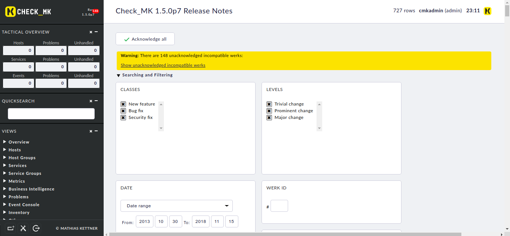

docker-check-mk
==========

[Dockerfile](https://www.docker.com) for [Open Monitoring Distribution (OMD)](http://omdistro.org).

Run from Docker Hub
-------------------

A pre-built image is available on [Docker Hub](https://hub.docker.com/r/nhanpt14/checkmk) and can be run as follows:

    docker run -dit nhanpt14/checkmk:1 --name=checkmk /bin/bash

This will leave a shell open to access the container.

Checkmk will become available on [http://172.X.X.X/monitoring](http://172.X.X.X/monitoring).

    docker exec -it checkmk /bin/bash
    su - monitoring
Change your admin password:

    htpasswd -b -c etc/htpasswd cmkadmin password
 
Then login is `cmkadmin` with password `password`.
To find out the IP address, run `ip a` in the container shell.

Build from Source
-----------------

The Docker image can be built as follows:

    git clone https://github.com/phamthanhnhan14/docker-omd
    cd docker-omd
    docker build -t="lastest" .

== Screenshot
-----------------

